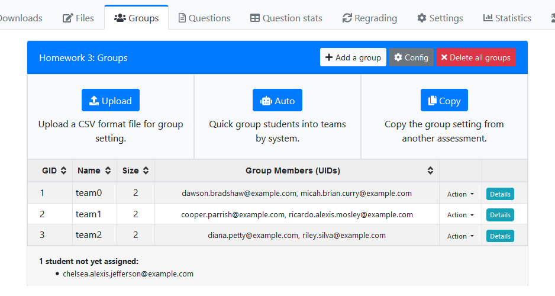
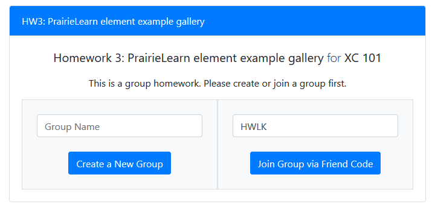
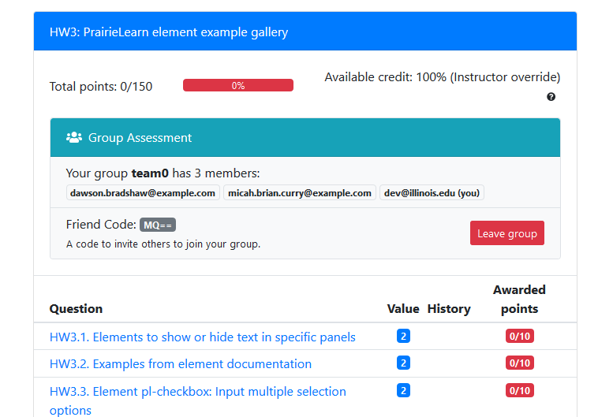

# Creating collaborative Assessments

## Enabling group work for collaborative assessments

By default, assessment instances are tied to only one user. By setting `groupWork: true`, multiple students will be able to work on the same assessment instance.
Information about the group configuration can be set in the `infoAssessment.json` file. For example: 
```json
{
        "groupWork": true,
        "groupMaxSize": 6,
        "groupMinSize": 2,
        "studentGroupCreate": true,
        "studentGroupJoin": true,
        "studentGroupLeave": true,
}
```
Attribute | Type | Default | Description
--- | --- | --- | ---
`groupWork` | boolean | false | Enable the group work for the assessment.
`groupMaxSize` | integer | - | The maximum size of a group (default: no minimum).
`groupMinSize` | integer | - | The minimum size of a group (default: no maximum).
`studentGroupCreate` | boolean | false | Allow students to create groups.
`studentGroupJoin` | boolean | false | Allow students to join other groups by join code.
`studentGroupLeave` | boolean | false | Allow students to leave groups.

Please notice: changing an assessment from group -> individual or vice versa after students have started working on it will cause student work to be lost.

### Instructor options for groupWork



Underneath the "Groups" tab in an assessment, instructors have three ways of assigning students to different groups:

1. Uploading a CSV file in the following format:
```
groupName,UID
groupA,one@example.com
groupA,two@example.com
groupB,three@example.com
groupB,four@example.com
```

2. Automatically assigning students, either to fill out existing groups or to make entirely new ones.

3. Copying the group assignments from another assessment.

A copy of the current group assignments can be saved from the "Downloads" tab, under `<assessment>_group_configs.csv`

### Student options for groupWork



If an instructor does not assign a student to a group, the student will need to join one before opening their assessment instance. They can either create a new one or join an existing group via a join code, which they can get from another classmate.

When calculating a student's grade for a group assessment, PrairieLearn will always use the score of their group's assessment instance.

> Note: Students cannot see eachother's edits in real-time, although this is planned for a future version of PrairieLearn.



Students are able to see their groupmates' UIDs, which can become a point of contact to communicate with eachother outside of PrairieLearn. They are also able to leave their group to join a different one.
