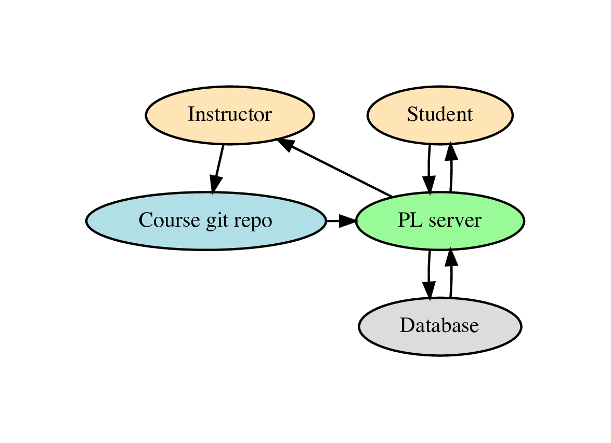

# Syncing course content to the live website

The model that PrairieLearn uses for course content is that it is developed on your own local copy of PrairieLearn (see the [Installing page](installing.md)) and then pushed to the live website via GitHub.

The two steps are:

1. On your local computer, sync or push your course content to GitHub.

2. On the live website at [https://prairielearn.engr.illinois.edu](https://prairielearn.engr.illinois.edu), go to your course, select the "Sync" page in the menu bar, and then click the "Pull from remote git repository” button.

## Course admin permissions

PrairieLearn controls administrative access to a course and course instance from the "Staff" tab. Course staff permissions are separated into *course content roles* and *student data roles*.

### Course content access

[Course content permissions](staff.md#course-content-access-roles) control the ability to view, edit, and sync course content from GitHub to the production server. These settings are made via the Staff tab on the production server. Course `Owners` have the ability to add a new user/role setting.

Level | Permissions
--- | ---
Owner | Can sync content, edit in the browser, and add/remove course permissions for other people.
Editor | Can sync content, edit in the browser, but cannot change other people's permissions.
Viewer | Can view course level content (question code and issues), but can't edit or sync content.
Previewer | Can view course level content (questions and issues), but can't view question code, edit or sync content.

Users must have been logged in to PrairieLearn before they can be given course permissions. To get sync permissions, a user must have `Ownwer` or `Editor` roles.

Course level access only enables access to Questions and their related issues. Access to course instance data is
controlled by [student data roles](staff.md#student-data-access-roles).

## Version control with git

PrairieLearn treats your course content as *source code*, and encourages your to develop it with the full power of git as a [version control system](https://en.wikipedia.org/wiki/Version_control).

Some good resources for learning about git are:

* [Git book](https://git-scm.com/book/en/v2)
* [Software Carpentry's git course](https://swcarpentry.github.io/git-novice/)
* [tryGit tutorial](https://try.github.io/)

You can use any git client you like on your local machine. The [commandline git interface](https://git-scm.com/downloads) is available on all platforms. Some popular graphical clients are [GitHub Desktop](https://desktop.github.com), [TortoiseGit](https://tortoisegit.org), and [SourceTree](https://www.sourcetreeapp.com).
